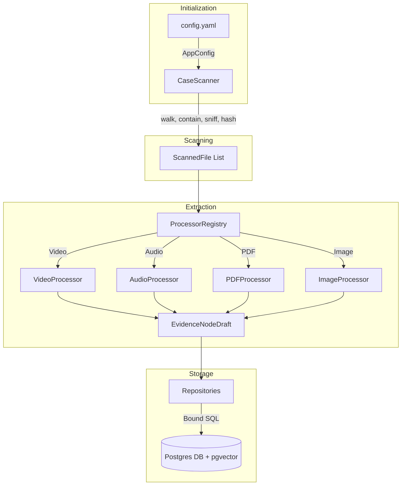

# Evidence Ingestion Pipeline

Multi-modal forensic evidence ingestion. Takes a case folder of mixed media (video, audio, image, PDF), registers every file with a cryptographic hash, and extracts it into a queryable evidence graph in Postgres + pgvector.

Phase 1 (ingestion) is complete and tested. Phases 2+ (embeddings, face/voice clustering, entity extraction, identity resolution) build on `evidence_node`.

---

## Commands & Quick Start

```bash
# Postgres (once)
brew services start postgresql@17
createdb -U "$(whoami)" -O postgres evidence_db
psql -U postgres -d evidence_db -c 'CREATE EXTENSION IF NOT EXISTS vector'

# Credentials (the password is never read from config.yaml)
cp .env.example .env && set -a && source .env && set +a

# Run
venv/bin/python3 -m ingestion ingest          # scan + ingest the configured case
venv/bin/python3 -m ingestion ingest -v       # with debug logging
venv/bin/python3 -m ingestion verify          # counts currently stored
venv/bin/python3 -m pytest tests/ -q          # 218 tests, ~3s
```

---

## Architecture

Data flows in one direction, and each stage only knows the stage's contract:



### Module Responsibilities

| Module | Responsibility |
|---|---|
| `config.py` | Load + validate YAML; database settings from env |
| `models.py` | Domain types (`ScannedFile`, `EvidenceNodeDraft`, `MediaType`) — no I/O |
| `security.py` | Path containment, type sniffing, hashing, permissions |
| `workspace.py` | Where derived artefacts go (names from SHA256, not filenames) |
| `scanner.py` | Folder walk → validated, hashed `ScannedFile` list. **No DB.** |
| `media/` | `probe` (PyAV), `scenes` (PySceneDetect), `frames` (PyAV), `audio` (ffmpeg) |
| `processors/` | One class per media type, returning drafts. **No DB.** |
| `repositories.py` | All SQL. Nothing else in the codebase writes SQL. |
| `pipeline.py` | Sequencing + error policy only |
| `cli.py` | Typer commands, Rich output |

### Design rules

These are the ones that will bite you if broken:

1. **Processors never touch the database.** They return `EvidenceNodeDraft` objects; the pipeline persists them. This is what lets processor tests run without Postgres.
2. **All SQL lives in `repositories.py`**, with fixed column lists and bound parameters. No identifier or value is ever interpolated into a query string.
3. **Adding a media type is pure addition**: write a `FileProcessor` subclass, register it in `processors/__init__.py::build_registry`. Nothing else changes — `pipeline.py` dispatches through the registry.
4. **Collaborators are constructor-injected.** `build_registry` and `build_pipeline` are the only places that name concrete classes.
5. **One bad file must never abort a run.** Per-file failures become a `FileReport(status="failed")`; only config/connection/schema errors are fatal.
6. **Re-running must be idempotent.** `replace_for_source` deletes a file's existing nodes before inserting.
7. **An unchanged file is never re-extracted.** `replace_for_source` deletes before inserting, so rebuilding a file also destroys the *enrichment* phase 2 wrote onto its nodes (embeddings, transcripts). `IngestionPipeline` therefore compares the stored hash first and reports `status="unchanged"`, preserving the rows. 

---

## Security model

The case folder is **untrusted input**. Evidence arrives from seized devices, third parties, and opposing counsel. Every guard below has a test in `tests/test_security.py` or `tests/test_repositories.py`.

| Threat | Control | Where |
|---|---|---|
| Symlink escaping the case folder | Resolve both sides, assert containment; refuse symlinks outright | `security.resolve_within`, `assert_regular_file` |
| Directory traversal via config | `FileEntry.path` rejects absolute paths and `..` | `config.FileEntry` |
| Symlinked directory loops | `rglob(recurse_symlinks=False)` | `scanner._walk` |
| FIFOs/devices blocking on read | `assert_regular_file` | `security.py` |
| Extension/type masquerade | Content sniffing (puremagic) beats declaration **and** extension; conflict stored in `source_file.type_mismatch` | `security.classify` |
| Decompression bombs (image) | Explicit pixel check + Pillow's `MAX_IMAGE_PIXELS` | `processors/image.py` |
| Decompression bombs (PDF) | Page cap; render zoom clamped to a pixel budget | `processors/pdf.py` |
| Oversized files | `max_file_bytes` before any decode | `scanner._inspect` |
| Runaway video | `max_video_seconds`, global `max_frames_per_file` | `media/scenes.py`, `media/frames.py` |
| ffmpeg hanging forever | `timeout`, `-nostdin`, `stdin=DEVNULL` | `media/audio.py` |
| Argument injection into ffmpeg (`-i.mp4`) | Absolute paths only — they cannot parse as flags | `security.assert_safe_external_path` |
| Filename injection into output paths | Derived names come from the SHA256 prefix | `workspace.py` |
| SQL injection via filename/metadata/text | Bound parameters everywhere | `repositories.py` |
| Credential in version control | Password from env only; `password:` in YAML is dropped | `config.DatabaseSettings.build` |
| Credential in logs | `SecretStr` + `safe_dsn()` | `config.py`, `db.py` |
| Sensitive derivatives world-readable | Dirs `0700`, files `0600` | `security.ensure_private_dir`, `harden_file` |
| Evidence tampering between runs | Same path + different hash is flagged | `repositories.SourceFileRepository.register` |

**Rules for new code:**
- Never pass a user-influenced path to a subprocess without `assert_safe_external_path`.
- Never build SQL with f-strings or `.format()`.
- Any new decoder gets a resource limit in `config.Limits` before it ships.
- Originals are read-only. Derived artefacts go in `data/`, never beside the evidence.

---

## Database

Postgres 17 + pgvector 0.8.6, database `evidence_db`. Schema in `db/schema.sql`, applied automatically on every run (all statements are `IF NOT EXISTS`, so it doubles as the migration path).

Nine tables: `case`, `source_file`, `evidence_node`, `entity`, `face_cluster`, `voice_cluster`, `identity`, `relationship`, `source_alignment`.

Vector dimensions on `evidence_node` — **these must match the models that fill them**:

| Column | Dim | Model |
|---|---|---|
| `text_embedding` | 384 | sentence-transformers MiniLM |
| `clip_embedding` | 512 | CLIP ViT-B/32 |
| `audio_embedding` | 1024 | speaker embedding |

HNSW cosine indexes exist on the text and CLIP columns.

### What phase 1 writes

| Media | `node_type` | Contents |
|---|---|---|
| video | `scene_segment` | one per segment; `metadata.frames[]` lists frame paths + timestamps; `file_path` is the extracted WAV |
| audio | `audio_track` | whole recording, normalised WAV |
| pdf | `page` | per-page text + rendered PNG |
| image | `image` | dimensions; `file_path` points at the original |

Embedding columns are left NULL for phase 2 to fill.

---

## Library choices

Prefer an existing library over hand-rolled code. Already resolved:

| Need | Use | Not |
|---|---|---|
| Config validation | pydantic / pydantic-settings | hand-written getters |
| File hashing | `hashlib.file_digest` (3.11+) | manual chunk loop |
| Content type detection | puremagic | extension maps alone |
| Video probe + frame decode | PyAV | OpenCV `CAP_PROP_POS_FRAMES` seeking — slow and inaccurate on B-frames |
| Audio transcode | ffmpeg subprocess | hand-rolled libswresample |
| Scene detection | PySceneDetect `ContentDetector` | frame differencing by hand |
| Date parsing | pydantic / `dateutil` | `strptime` chains |
| CLI + output | Typer + Rich | `argparse` + `print` |
| Bulk insert | `psycopg2.extras.execute_values` | per-row `execute` |

Installed and waiting for phase 2: faster-whisper, transformers, torch, torchvision, ultralytics, paddleocr, sentence-transformers, ollama, librosa, scikit-learn.

---

## AI Models & Infrastructure (Phase 2)

| Task | Model | Backend | Quantization | Approx RAM | Why Chosen |
|---|---|---|---|---|---|
| Speech-to-Text | Whisper `large-v3-turbo` | faster-whisper (CTranslate2) | int8 (CPU) or mps (experimental) | 1.5 GB | Excellent accuracy, fast, low memory. |
| Speaker Diarization | pyannote.audio 3.0 | PyTorch (MPS) | FP32 | 1.0 GB | State-of-the-art speaker segmentation. |
| Audio Event Detection | AST (Audio Spectrogram Transformer) | PyTorch (MPS) | FP32 | 0.4 GB | Detects gunshots, screams, shouts. |
| Visual Violence (zero-shot) | CLIP ViT-B/32 | PyTorch (MPS) | FP32 | 0.6 GB | Flexible prompts, no fine-tuning needed. |
| Object Detection | YOLOv8s (or weapon-specific from Roboflow) | Ultralytics (MPS) | FP16 | 0.5-0.8 GB | Good balance speed/accuracy. |
| Image Captioning / VQA | Qwen2.5-VL 7B Instruct | MLX-VLM or Ollama | 4-bit MLX / Q4_K_M | 5 GB | Best open VLM for local, supports detailed captions and visual questions. |
| LLM (Q&A, Entity Extraction) | Qwen2.5 7B Instruct | Ollama / llama.cpp | Q4_K_M | 4.5 GB | Strong reasoning, JSON output. |
| Text Embeddings | sentence-transformers `all-MiniLM-L6-v2` | PyTorch (MPS) | FP32 | 0.1 GB | Lightweight, good semantic search. |
| Cross-modal Embeddings | CLIP ViT-B/32 (same as above) | PyTorch (MPS) | FP32 | 0.6 GB | Aligns text and images. |
| Face Detection & Recognition | insightface (buffalo_l) or face_recognition (dlib) | PyTorch/MPS or CPU | FP32 | 0.3 GB | Accurate face embeddings for clustering. |
| OCR | PaddleOCR PP-OCRv4 | PyTorch (MPS) | FP32 | 0.5 GB | Best open-source OCR, many languages. |
| PDF Text Extraction | PyMuPDF | - | - | minimal | Native, fast. |

---

## Environment notes

- **Python 3.13**, not 3.14 — torch and paddleocr have no 3.14 wheels.
- **Postgres 17**, not 16 — brew's `pgvector` bottle only ships extension binaries for 17 and 18.

---

## Testing

218 tests, no network, ~3s. `tests/test_repositories.py` needs Postgres and skips cleanly without it; `tests/test_video.py` needs ffmpeg and builds its own fixtures with it.

When adding a feature, add tests in the matching file:
`test_security.py` (guards), `test_config.py` (validation/secrets), `test_processors.py` (extraction + limits), `test_pipeline.py` (orchestration, using the fake repositories already defined there), `test_video.py` (real decode), `test_repositories.py` (SQL).

A security control without a test that tries to break it is not a control.
